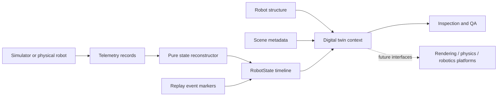

# Digital Twin Architecture

Interstice Telemetry v1.1 adds a durable description of an autonomous system
and its state without turning the package into a simulator. The contracts
separate four concerns that often become accidentally coupled:

1. `Robot` describes identity and structure.
2. `RobotState` describes every replay-relevant value at one timestamp.
3. `TwinTimeline` orders complete states and replay markers.
4. `Scene` describes the environment in which those states are interpreted.

Telemetry remains evidence received from a simulator, adapter, log, or future
physical robot. A reconstruction function interprets that evidence and emits
complete states. This preserves existing telemetry and replay formats while
allowing downstream tools to consume a stable digital-state model.

## Contract boundaries

The core models are plain JSON data with readonly TypeScript properties.
Factory functions copy, canonicalize, validate, and recursively freeze input.
They accept no functions, dates, class instances, non-finite numbers,
`undefined`, or circular references. Callers therefore cannot mutate retained
state through an input reference, and every accepted value has an unambiguous
JSON representation.

All physical units and clock domains are explicit at their owning boundary.
`RobotState.timestamp` is an integer count in the timeline's declared clock
domain. The initial clock domain is `unix-ms`; deterministic simulations may
name a different domain. Position, velocity, joint, and sensor units are
domain contracts between a robot definition and its producer. Scene length
units are explicit.

Each top-level model has its own schema version. These versions evolve
independently from the npm package and from existing replay-log versions.
Readers should reject semantics they cannot safely interpret rather than infer
them.

## Determinism

Canonical serialization recursively sorts object keys and normalizes negative
zero. Timeline state order is timestamp order. Replay events use the total
order `(timestamp, sequence, id)`. Telemetry reconstruction first uses the
total order `(timestamp, sequence, id)`, then invokes the supplied pure
reconstructor.

Determinism assumes the reconstructor is pure and that equivalent inputs use
the same schema versions and numeric values. Interstice does not hide clock,
randomness, filesystem, or network access inside reconstruction.

## Future systems

Renderer, physics, simulation-runtime, fleet-visualization, Unity, Unreal,
ROS, Gazebo, and NVIDIA Isaac interfaces are dependency-inversion seams. They
do not include implementations or imply wire compatibility with those
platforms. Adapters translate stable Interstice contracts at the boundary;
platform-specific data must not leak back into the core model except as
explicit JSON metadata.

No model in this release performs rendering, collision detection, dynamics,
networking, device I/O, or real-time scheduling.
